# Figures
## Figure 1
Evolution of $SR(W)$, $SR(Z)$, gradient norm, and training loss in the feedforward module (FFN) across 12 layers on GPT-Medium. The top panel shows unstable training (LR=1e-3), with a loss spike and sharp SR drop near step 8000, linking singularities to instability; the bottom panel shows stable training (LR=5e-4). Both cases exhibit rising SRs and alignment trends.
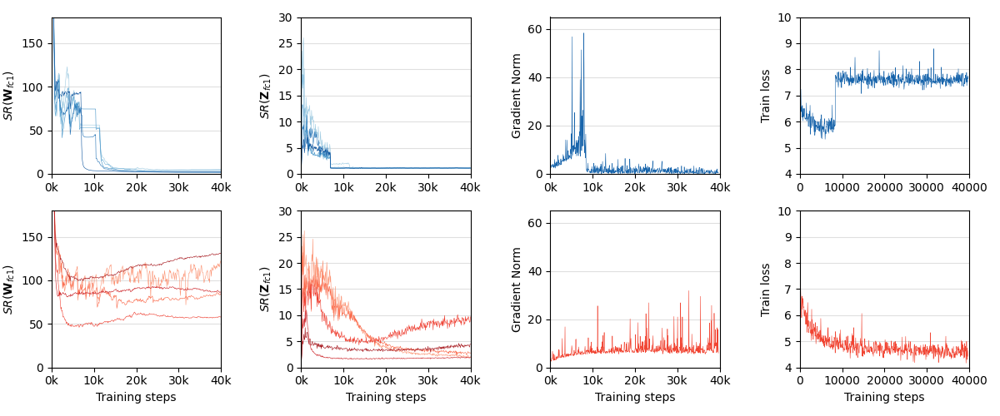

## Figure 2
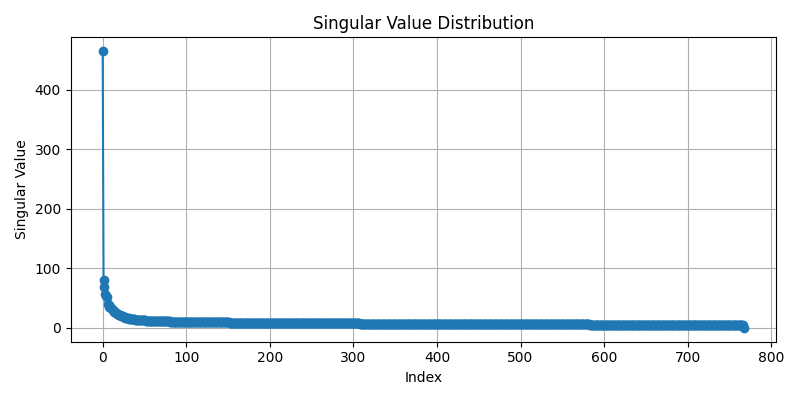

# Tables
## Table 1
Frequency of PSS activation across different settings.
| Model         | BERT-base     | BERT-base     | BERT-large    | BERT-large    | GPT-2-medium  | GPT-2-medium  | GPT-2-large   | GPT-2-large   |
|---------------|---------------|---------------|---------------|---------------|---------------|---------------|---------------|---------------|
| Steps         | @50k step     | @100k step    | @50k step     | @100k step    | @100k step    | @200k step    | @100k step    | @200k step    |
| Small LR      | 0.02% (lr=1e-4)         | 0.03% (lr=1e-4)     | 0.03% (lr=5e-5) | 0.03% (lr=5e-5) | 0.05% (lr=5e-4) | 0.03% (lr=5e-4) | 0.06% (lr=5e-5) | 0.05% (lr=5e-5) |
| Large LR      | 0.09% (lr=4e-4) | 0.06% (lr=4e-4) | 0.16% (lr=1e-4) | 0.11% (lr=1e-4) | 0.23% (lr=1e-3) | 0.15% (lr=1e-3)  | 0.19% (lr=1e-4)| 0.15% (lr=1e-4) |

## Table 2
Supplementary experiments to Table 6 of the original paper, comparing the performance of different stabilization methods on model stability under high learning rates.
The results for GC, OR, and QK-Norm at the smallest learning rate are omitted because the baseline already ensures stability.
|Model|BERT-large|BERT-large|GPT-2-Large|GPT-2-large|GPT-2-XL|GPT-2-XL|GPT-2-XL|
|----|----------|----------|-----------|-----------|--------|--------|--|
|LR   |5e-5|1e-4|5e-5|1e-4|1e-5|5e-5|1e-3|
|Naive|0/2 2.4±0.1|2/2 -|0/1 3.9|1/1 -|0/2 3.8±0.1|2/2 -|1/1 -|
|GC|-|0/2 2.9±0.1|-|0/2 5.2±0.3|-|0/1 4.2|1/1 -|
|OR|-|3/3 -|-|1/1 -|-|1/1 -|1/1 -|
|QK-Norm|-|0/2 2.9±0.2|-|1/1 -|-|0/1 3.9|1/2 4.5|
|PSS|0/2 2.4±0.1|0/2 2.7±0.1|0/1 4.0|0/1 4.2|0/1 3.8|0/1 3.9|0/2 4.6±0.1|

## Table 3
Supplementary experiments to Table 7 of the original paper, comparing the performance of different stabilization methods on model stability under inappropriate hyper-parameter settings.
|Hyper-parameters|Batch Size|Batch Size|LR Warmup Steps|LR Warmup Steps
|--|--|--|--|--|
||64|1|1000|1|
|Naive|0/3 3.0±0.2|4/4 -|0/3 3.0±0.2|3/3 -|
|GC|-|0/1 3.2|-|0/1 3.0|
|OR|-|0/2 4.0±0.1|-|1/1 -|
|QK-Norm|-|0/2 3.3±0.1|-|2/2 -|
|PSS|0/3 3.0±0.1|0/4 3.4±0.2|0/3 3.0±0.2|0/3 2.9±0.1|

## Table 4
Larger LRs with PSS at 70k steps vs baseline LR=1e-4 at 100k, showing PSS reduces compute at large LRs.
|Tasks|Test loss|CoLA(acc)|SST-2(acc)|MRPC(acc)|MNLI(acc)|
|--|--|--|--|--|--|
|Naive @ 100k steps(lr=1e-4)|3.05|50.8%|85.2%|82.4%|81.6%|
|PSS @ 70k steps(lr=2e-4)|2.92|51.0%|85.8%|81.7%|82.5%|
|PSS @ 70k steps(lr=4e-4)|2.84|52.3%|86.1%|84.6%|81.9%|

# Proof 
## Proof 1
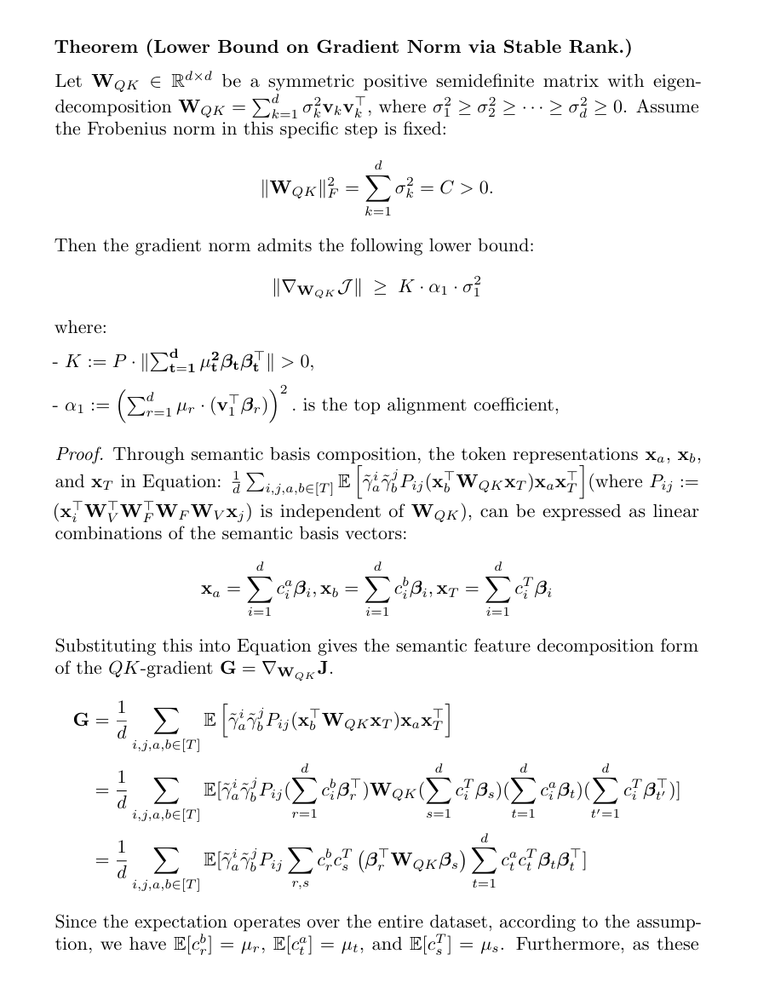
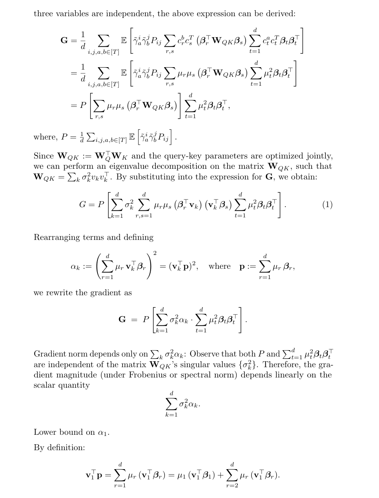
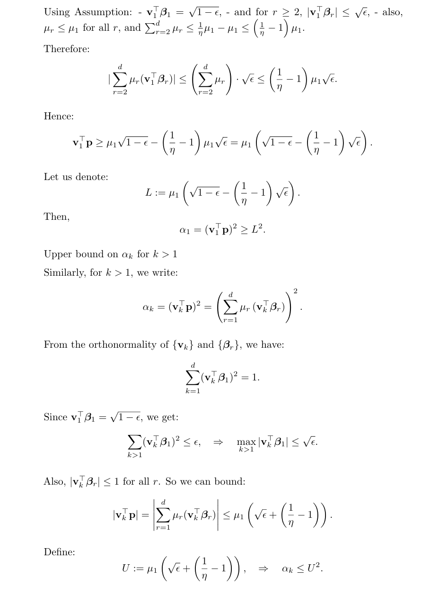
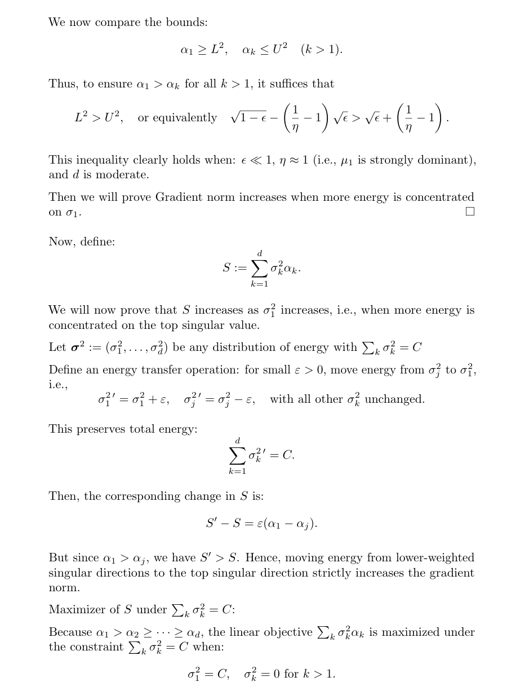
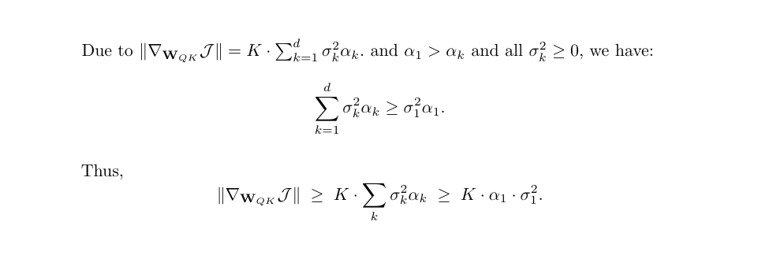

## Proof 2
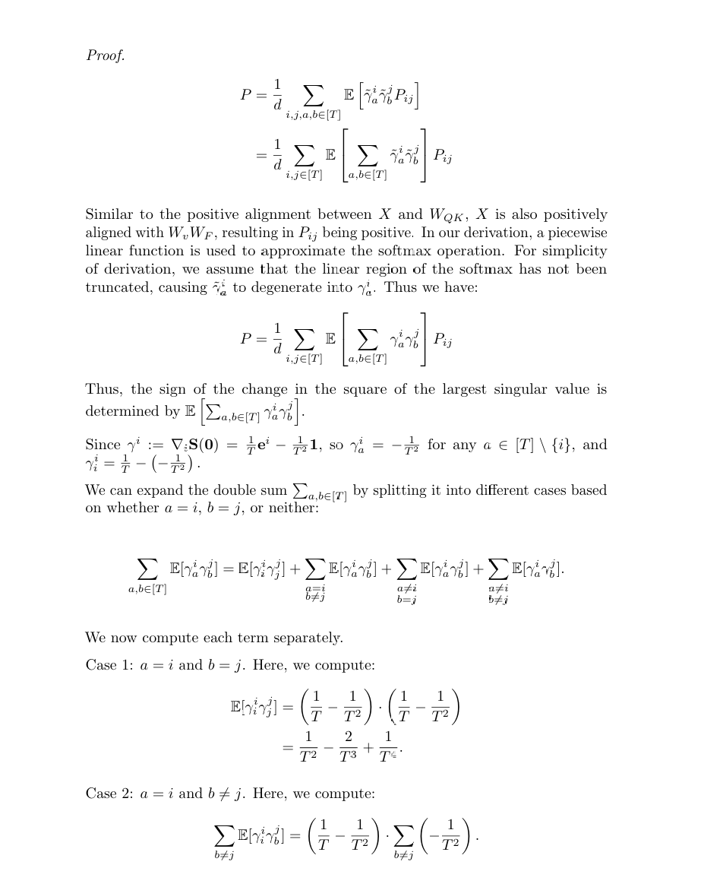
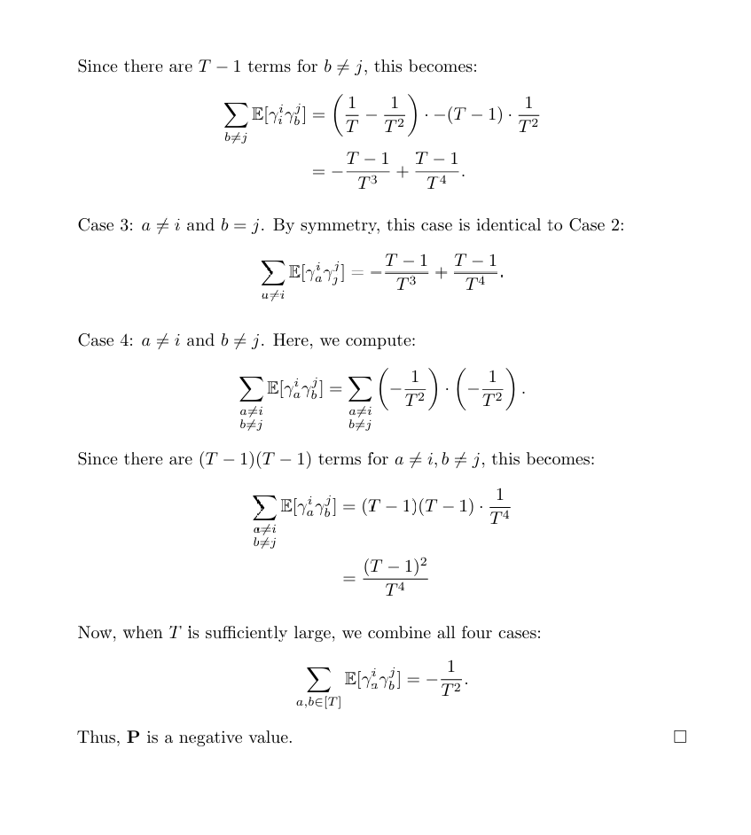

## Proof 3
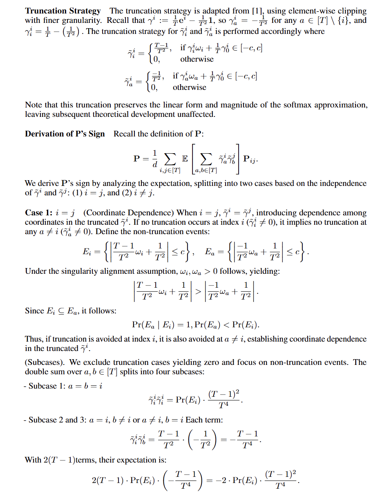
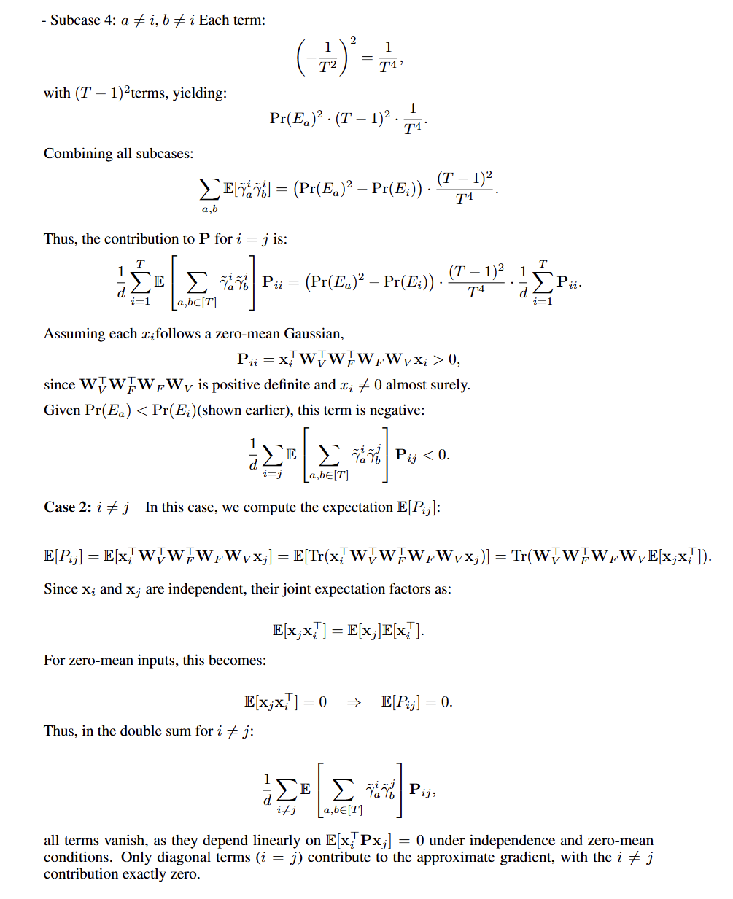
